# Mockups - Orbix

## Descripción

En esta carpeta se encuentran los mockups de la interfaz de usuario de Orbix,
organizados de acuerdo con los roles definidos para el sistema.

Los roles contemplados son:
- Administrativo
- Vendedor
- Inventario

Los mockups sirven como guía visual para el desarrollo del frontend.

---

## Rol Administrativo

El rol administrativo cuenta con acceso a las principales funcionalidades
de gestión del sistema.

### Funcionalidades
- **Dashboard**: resumen general del negocio (ingresos del mes, pedidos totales, clientes activos, valor de inventario, ventas anuales vs. meta y distribución de ventas por categoría).
- **Inventario**: control y consulta del stock disponible de productos.
- **Ventas**: registro y seguimiento de las ventas realizadas.
- **Clientes**: gestión de la información de los clientes registrados.
- **Proveedores**: gestión de la información de los proveedores del negocio.
- **Reportes**: generación y consulta de reportes del sistema.

### Mockups

**Login**


**Dashboard**
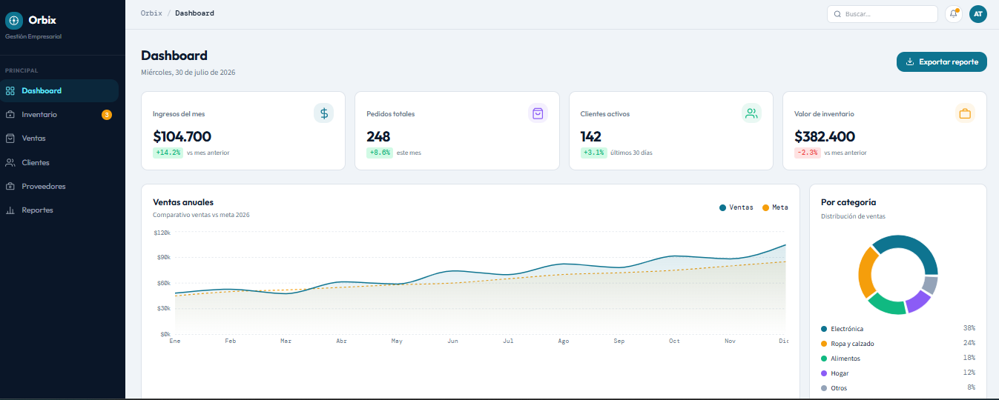

**Clientes**
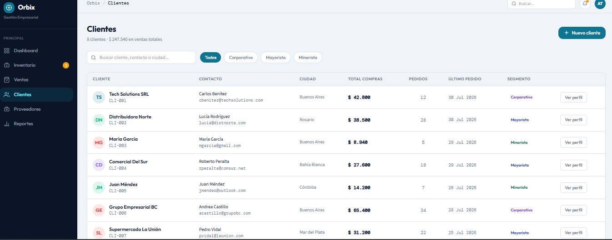

**Proveedores**
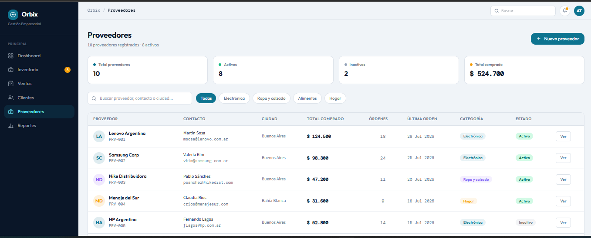

**Ventas**
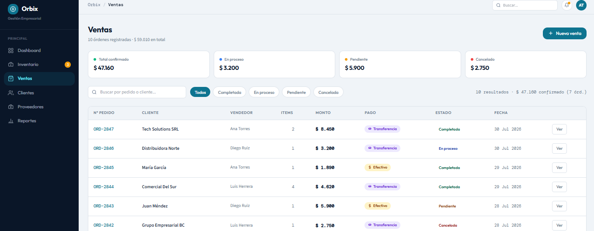

**Inventario**
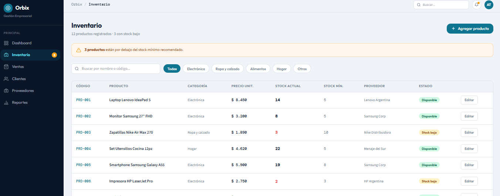

**Reportes**
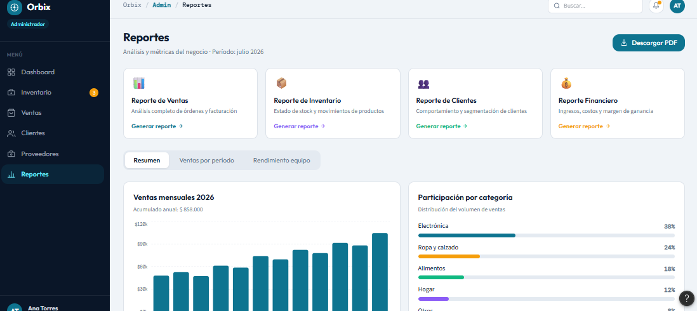

---

## Rol Vendedor

El rol vendedor está orientado principalmente a la gestión comercial.

### Funcionalidades
- **Dashboard**: métricas personales del vendedor (ventas del día/mes, número de clientes, ticket promedio y progreso frente a la meta mensual).
- **Productos**: consulta del catálogo de productos disponibles para la venta.
- **Clientes**: gestión de los clientes asignados o atendidos por el vendedor.
- **Ventas**: registro y consulta de las ventas propias del vendedor.

### Mockups

**Login**
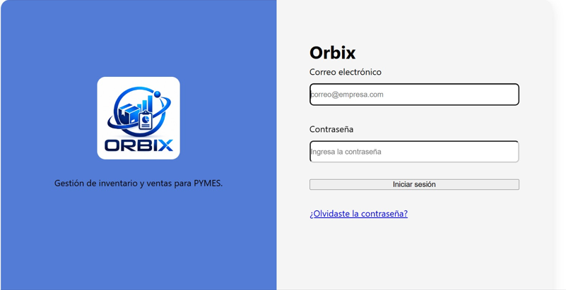

**Dashboard**
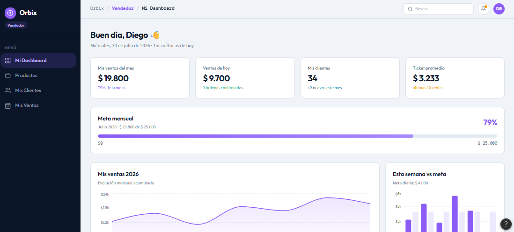

**Productos**
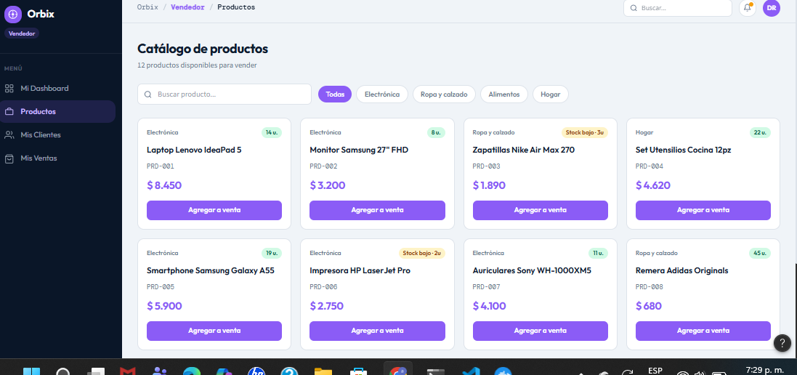

**Clientes**
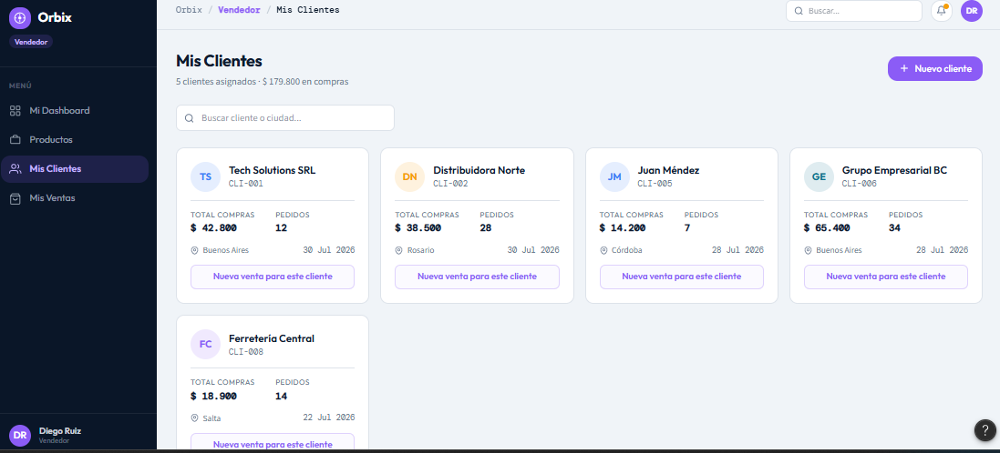

**Ventas**
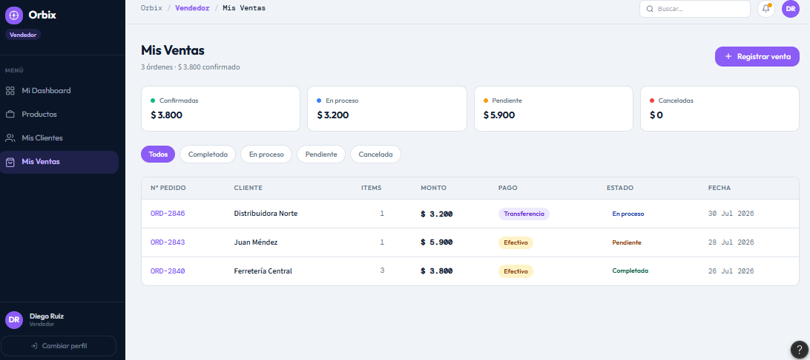

---

## Rol Inventario

El rol inventario está orientado al control de productos y existencias.

### Funcionalidades
- **Dashboard**: estado general del stock (valor total, productos con stock bajo, productos agotados y movimientos del día).
- **Productos**: consulta y administración de los productos registrados.
- **Inventario**: control de existencias y movimientos de entrada/salida de productos.

### Mockups

**Login**


**Dashboard**
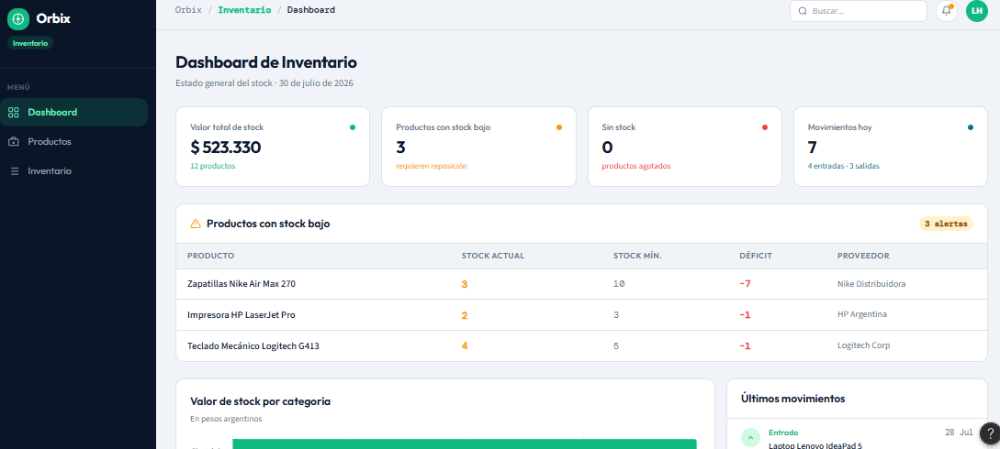

**Productos**
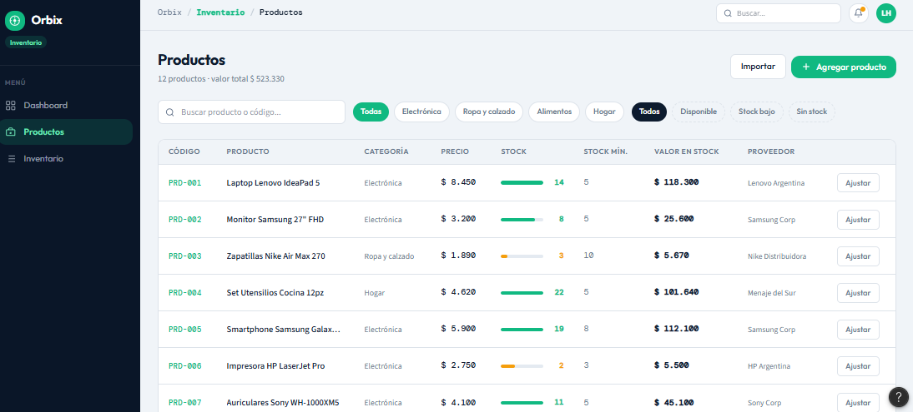

**Inventario**
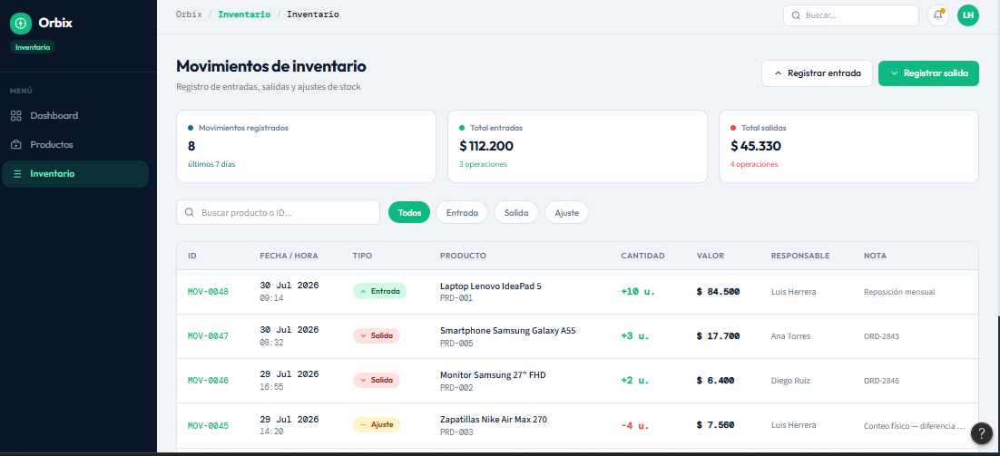

---

## Diseño visual

Los mockups mantienen una identidad visual común para Orbix:
- Barra lateral de navegación.
- Encabezado.
- Buscador.
- Notificaciones.
- Perfil del usuario.
- Tarjetas de información.
- Tablas.
- Filtros.
- Botones de acción.
- Diseño empresarial.

La navegación y las funcionalidades disponibles se adaptan según el rol
del usuario.

---

## Organización

```text
mockups/
├── administrativo/
│   ├── Login.png
│   ├── dashboard.png
│   ├── clientes.png
│   ├── proveedores.png
│   ├── ventas.png
│   ├── inventario.png
│   └── reportes.png
├── vendedor/
│   ├── Login.png
│   ├── dashboard.png
│   ├── productos.png
│   ├── clientes.png
│   └── ventas.png
└── inventario/
    ├── Login.png
    ├── dashboard.png
    ├── productos.png
    └── inventario.png
```
